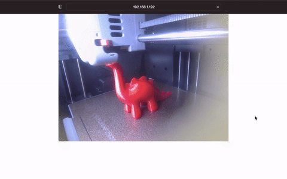

# Community-Driven MCP Development: A Real Bug Fix Story

## The Promise of MCP

MCP (Model Context Protocol) servers let anyone extend Claude's capabilities. But what makes them powerful isn't just the technology—it's that they can be built, tested, and improved collaboratively in real-time.

Here's a story from today that demonstrates exactly that.

## Built in Minutes

The initial MCP server to control my son's FlashForge Adventurer 5M Pro printer was built in a matter of minutes. Claude examined the printer's protocol, wrote the Python code, and I had a working server that could discover printers, check status, and access the camera stream.

It worked great. We moved on.

## Picking Up Where We Left Off

Days later, I came back to start another print. When I asked Claude to show me the printer status, here's what happened:

```
❯ ok lets view the current print

🖨️ SNMOME9900037

Model: Flashforge Adventurer 5M Pro
IP: 192.168.1.192
Status: 🟢 PRINTING (52.0% complete)

File: cutedino_shortlegs_fixed_fixed_fixed.3mf

[██████████░░░░░░░░░░] 52.0%
Layer: 147 / 550

Temperatures:
- Nozzle: 220°C → 220°C
- Bed: 50°C → 50°C

📹 Camera
Stream URL: http://192.168.1.192:8080/?action=stream
The camera stream timed out - you may need to check the camera
settings on the printer's touchscreen...
```

```
❯ i opened the stream in my browser and its working fine, why did you think it wasn't available?
```

Claude dug into the code and found the issue: the camera availability check was timing out on first access. The MJPEG stream wasn't responding fast enough to the initial request.

I suggested adding retry logic with exponential backoff to handle the slow first connection, and Claude implemented the fix. It's been working smoothly since.

## Why This Matters

**The development cycle here was:**
1. Build initial server in minutes
2. Use it, move on to other things
3. Come back, hit an edge case
4. Fix it in the same conversation
5. Continue using it smoothly

**This is exactly why community-driven MCP development works:**

- **Rapid prototyping** - The initial server took minutes, not days
- **Real-world testing** - Users find bugs developers miss
- **Immediate iteration** - Report an issue, get a fix, keep working
- **Continuity** - Pick up where you left off, context preserved



*The cute dino print in action, captured via the camera stream.*

## The Takeaway

MCP servers aren't finished products shipped from on high. They're living tools that improve through use. Build something in minutes, use it, improve it when you hit an edge case, and keep going.

That's the real power of community-driven MCP development.

You can check out my code online here: [github.com/anthony-ism/flashforge-claude-skill](https://github.com/anthony-ism/flashforge-claude-skill)

---

*January 15, 2026*
